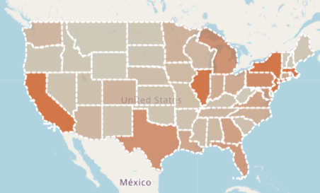
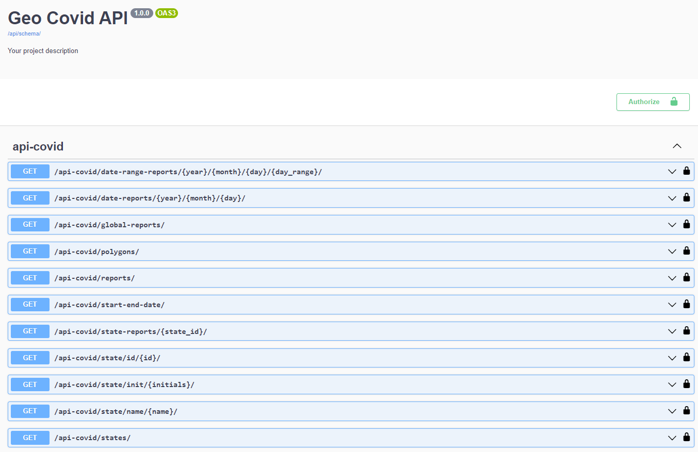
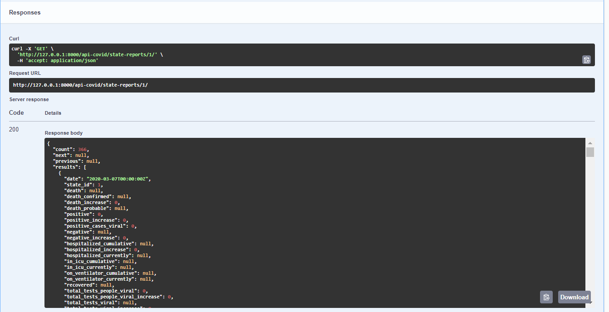

<!-- icons  -->
[1.1]: https://img.shields.io/badge/GitHub-100000?style=for-the-badge&logo=github&logoColor=white
[2.1]: https://img.shields.io/badge/LinkedIn-0077B5?style=for-the-badge&logo=linkedin&logoColor=white
[3.1]: https://img.shields.io/badge/Medium-12100E?style=for-the-badge&logo=medium&logoColor=white
[4.1]: https://img.shields.io/badge/Twitter-1DA1F2?style=for-the-badge&logo=twitter&logoColor=white

<!-- links to your social media accounts -->

[1]: https://github.com/produdez
[2]: https://www.linkedin.com/in/produdez/
[3]: https://medium.com/@produde
[4]: https://twitter.com/_Produde_

# Geo-covid (Backend API)

<p align="center">
    
</p>

**Description:**

Geo-covid: A data dash board for the Covid 19 situation in the USA

This repo is the backend api for my geo-covid project (a data dashboard embedded as a web application).

Front-end repository can be found [here](https://github.com/produdez/us-geo-covid)

## Data

US covid data from 01-2020 -> 03-2021 period ([Ref](https://covidtracking.com/data/download))

Their data API is available [here](https://covidtracking.com/data/api/version-2)

## Demo


> Here's a screen shot of the `/doc` page generated with `DjangoREST`

## General Information

The back-end aims to

- Simulate a data storage + API of the Covid 19 data

- This includes
  1. Process the data downloaded from the source
  2. Load data to database
  3. Provide an data API for front-end to visualize

## Technologies Used

- Mongo DB
- Django
- Django REST API
- Python Script

## Endpoints

End point local link: [`http://127.0.0.1:8000/`](http://127.0.0.1:8000/doc/#/)

### general

| API endpoint | Description |
| --- | --- |
| /doc | Show API doc and sample usage |

### api-covid

Prefix: `/api-covid/`

| API endpoint | Description |
| --- | --- |
| `/date-range-reports/{year}/{month}/{day}/{day_range}/` | Report from all states in a range of days look up by start day and day interval |
| `/date-reports/{year}/{month}/{day}/` | Report from all states in a single day look up by date (year, month, day) |
| `/global-reports/` | National report aka: summarized report of all states in a given day |
| `/polygons/` | Polygon data of states (used for map rendering) |
| `/reports/` | All reports of all states  |
| `/start-end-date/` | Start and end date of reports in the data |
| `/state-reports/{state_id}/` | All report (all days) for a state lookup by state id (stored in report) |
| `/state/id/{id}/` | Detail of a state lookup by id |
| `/state/init/{initials}/` | Detail of a state lookup by initials |
| `/state/name/{name}/` | Detail of a state lookup by name |
| `/states/` | Detail of all states |

## Screenshot

Example output of endpoint: Getting all reports of state with id=1 

`http://127.0.0.1:8000/api-covid/state-reports/1/`



## Setup

Requirements and Installations:

1. `pip install python==3.9`
2. Install packages

    ```[bash]
        pip install -r requirements.txt
    ```

3. Install mongodb ([ref](https://www.mongodb.com/docs/manual/installation/))
4. Setup environment

    ```[bash]
        cp .env.dist .env

        # then change needed settings
   ```

## Usage

1. Push data onto your running `Mongo` database

    ```[bash]
        python /scripts/load_csv_to_database.py

        # or

        python manage.py runscript load_csv_to_database
    ```

2. Run server

    ```[bash]
        python manage.py runserver
    ```

3. Access `http://127.0.0.1:8000/doc` to view endpoint api docs

## Project Structure

- `/data`: raw csv data
- `/scripts`: script to load data to database: include a `.py` version and a `notebook.ipynb` version to show step by step execution
- `/us_covid_api` main project files, inside includes these main files:
    1. `models.py`: Object relational mapping of database items/table
    2. `serializers.py`: Turn Object to JSON object
    3. `views.py`: Request/Endpoint
    4. `urls.py`: Set endpoint URL

## Contact

Created by [@produdez](https://github.com/produdez) - feel free to contact me or follow my blog on medium ❤️!

<!-- [![alt text][1.1]][1] -->
[![alt text][2.1]][2]
[![alt text][3.1]][3]
[![alt text][4.1]][4]
